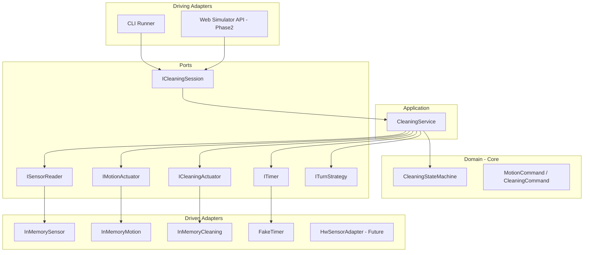
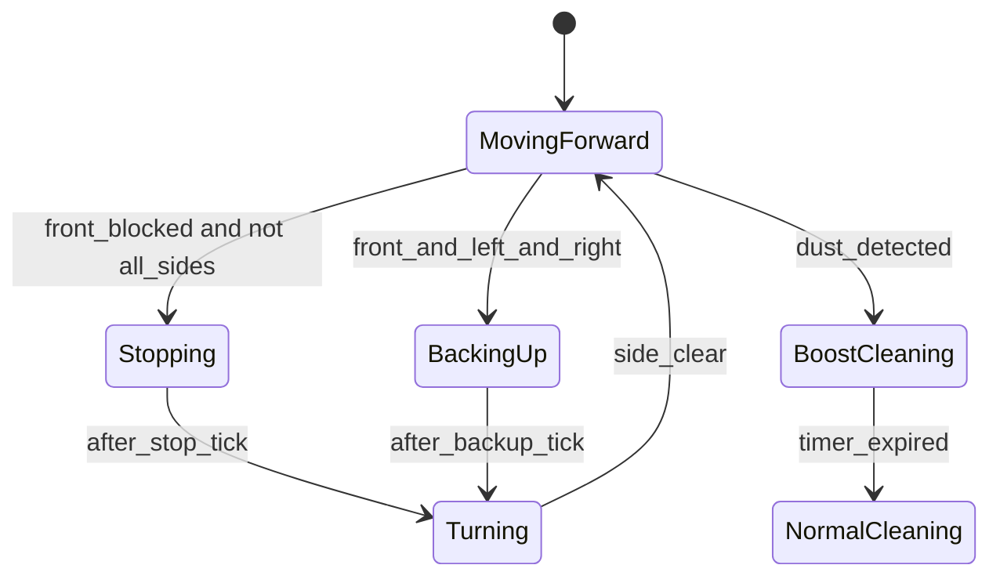

# 로봇청소기 Control SW 개발 계획

## 목표 및 범위

[Preliminary_Requirements.md](doc/Preliminary_Requirements.md) 기준 **자동 청소 기능**만 구현합니다. HW 제어 세부사항은 포트로 추상화하고, 실제 모터/센서 대신 테스트 더블·시뮬레이터 어댑터로 검증합니다.

| 요구사항 | 도메인 동작 |
|---------|------------|
| 직진하며 청소 | `MovingForward` + `CleaningNormal` |
| 장애물 감지 시 정지 → 좌/우 회전 → 전진 청소 | `Stopping` → `Turning` → `MovingForward` |
| 전·좌·우 모두 장애물 시 후진 → 회전 → 전진 | `BackingUp` → `Turning` → `MovingForward` |
| 먼지 감지 시 청소 파워 업 (일정 시간) | `CleaningBoost` + 타이머 만료 후 `CleaningNormal` |

**가정 (테스트 가능하도록 명시화)**
- 좌/우 회전 선택: `ITurnStrategy` 포트로 주입 (기본: **좌측 우선**)
- 먼지 부스트 지속 시간: 설정값 (기본 **3초**, `ITimer`로 검증)
- 한 틱(tick) = 센서 읽기 → 의사결정 → 액추에이터 명령 1회

---

## 헥사고날 아키텍처



**의존성 규칙**
- `domain/`: 표준 라이브러리만 사용 (포트·어댑터·GTest 의존 금지)
- `application/`: `domain` + `ports`(인터페이스)만 의존
- `adapters/`: `ports` 구현, `application` 호출
- 미래 확장(센서 추가, 앱 통신, ML)은 **새 포트/어댑터 추가**로 흡수

---

## 디렉터리 구조 (제안)

```
c:\yul2ya\
├── CMakeLists.txt
├── cmake/                    # FetchContent: GTest
├── doc/
│   └── Preliminary_Requirements.md
├── src/
│   ├── domain/
│   │   ├── sensor_snapshot.hpp
│   │   ├── robot_state.hpp
│   │   ├── cleaning_mode.hpp
│   │   ├── motion_command.hpp
│   │   └── cleaning_state_machine.hpp / .cpp
│   ├── application/
│   │   └── cleaning_service.hpp / .cpp
│   ├── ports/
│   │   ├── sensor_reader.hpp
│   │   ├── motion_actuator.hpp
│   │   ├── cleaning_actuator.hpp
│   │   ├── timer.hpp
│   │   ├── turn_strategy.hpp
│   │   └── cleaning_session.hpp
│   └── adapters/
│       ├── in_memory/        # 테스트·로컬 실행용
│       └── cli/              # main 진입점
├── tests/
│   ├── domain/               # 순수 도메인 TDD
│   ├── application/          # 포트 페이크로 서비스 TDD
│   └── adapters/             # 어댑터 통합 테스트 (선택)
└── simulator/                # Phase 2
    ├── server/               # C++ HTTP 또는 별도 경량 서버
    └── web/                  # 간단 UI
```

코딩 스타일은 [.cursor/rules/cpp-formatting.mdc](.cursor/rules/cpp-formatting.mdc) (PascalCase 클래스/함수, snake_case 변수, Allman 중괄호)를 따릅니다.

---

## TDD 전략 (Inside-Out)

각 기능마다 **Red → Green → Refactor** 사이클을 반복합니다. 테스트 이름은 요구사항을 그대로 반영합니다.

### 1단계: 도메인 (가장 안쪽, Mock 없음)

`CleaningStateMachine::Tick(SensorSnapshot)` 형태의 **순수 상태 전이**부터 시작합니다.

**테스트 우선 순서 (tests/domain/)**

1. `GivenMovingForward_WhenNoObstacle_ThenKeepMovingAndCleaning`
2. `GivenMovingForward_WhenFrontObstacle_ThenStopThenTurn`
3. `GivenTurning_WhenClear_ThenResumeForwardCleaning`
4. `GivenMovingForward_WhenFrontLeftRightBlocked_ThenBackUpThenTurn`
5. `GivenCleaningNormal_WhenDustDetected_ThenBoostCleaning`
6. `GivenCleaningBoost_WhenTimerExpired_ThenReturnToNormal`

도메인은 `MotionCommand`, `CleaningCommand` enum/struct를 **반환**만 하고, 실제 HW 호출은 하지 않습니다.

### 2단계: 애플리케이션 (포트 페이크)

`CleaningService::Tick()`이 포트를 조합합니다.

**tests/application/ 에서 페이크 구현**
- `FakeSensorReader`: 장애물·먼지 시나리오 프리셋
- `FakeMotionActuator` / `FakeCleaningActuator`: 마지막 명령 기록(assert용)
- `FakeTimer`: 수동 시간 진행 (`Advance(ms)`)
- `FixedTurnStrategy`: 좌/우 고정

**테스트 예**
- 센서 stub → 서비스 tick → 액추에이터에 `Stop`/`TurnLeft`/`MoveForward`/`SetPower(Boost)` 전달 여부 검증
- 여러 tick 시퀀스로 회전 완료 후 전진 복귀 검증

### 3단계: 인메모리 어댑터 + CLI

- `adapters/in_memory/`: 위 페이크를 프로덕션 경로에도 재사용 가능한 형태로 정리
- `adapters/cli/main.cpp`: 시나리오 JSON/텍스트 입력으로 수동 검증 (선택)

---

## 핵심 도메인 모델

```cpp
// 개념 스케치 (구현 시 헤더로 분리)
struct SensorSnapshot
{
    bool front_blocked;
    bool left_blocked;
    bool right_blocked;
    bool dust_detected;
};

enum class RobotMotionState { Idle, MovingForward, Stopping, Turning, BackingUp };
enum class CleaningMode { Off, Normal, Boost };

struct TickResult
{
    RobotMotionState next_motion_state;
    CleaningMode next_cleaning_mode;
    MotionCommand motion;   // MoveForward, Stop, TurnLeft, ...
    CleaningCommand clean;  // SetNormal, SetBoost, SetOff
};
```

**상태 전이 요약**



`Stopping`/`BackingUp`/`Turning`은 내부 서브스테이트로 쪼개어 **한 tick에 하나의 액추에이터 명령**만 내리도록 설계합니다 (테스트 단순화).

---

## CMake / 빌드 설정

루트 [CMakeLists.txt](CMakeLists.txt) (신규):

- `CMAKE_CXX_STANDARD 17`
- `FetchContent`로 Google Test 가져오기
- 타깃 분리:
  - `rvc_domain` (STATIC)
  - `rvc_application` (STATIC, links domain)
  - `rvc_adapters` (STATIC)
  - `rvc_cli` (EXECUTABLE)
  - `rvc_tests` (`gtest_discover_tests`)

빌드 명령 (Windows):

```powershell
cmake -S . -B build -DCMAKE_BUILD_TYPE=Debug
cmake --build build
ctest --test-dir build --output-on-failure
```

---

## Phase 1 일정 (권장 스프린트)

### Sprint 0 — 골격 (0.5일)
- CMake + GTest 셋업
- 빈 타깃 빌드·테스트 러너 동작 확인
- `ports/` 인터페이스 헤더 스켈레ton

### Sprint 1 — 직진 청소 (1일)
- TDD: 무장애물 시 전진+일반청소
- `CleaningService` 최소 구현
- 인메모리 어댑터 + CLI 1 시나리오

### Sprint 2 — 단일 방향 장애물 회피 (1~2일)
- TDD: 전방 장애물 → 정지 → 회전 → 재개
- `ITurnStrategy` 도입
- 좌/우 모두 막힌 경우 turn 방향 결정 규칙 테스트

### Sprint 3 — 삼방 막힘 후진 (1일)
- TDD: 전·좌·우 장애물 → 후진 → 회전 → 전진
- `BackingUp` 서브스테이트

### Sprint 4 — 먼지 부스트 (1일)
- TDD: 먼지 감지 → Boost, 타이머 만료 → Normal
- `ITimer` 포트 + `FakeTimer`
- 부스트 중 장애물 처리 우선순위 테스트 (장애물 회피가 청소 모드보다 우선)

### Sprint 5 — 리팩터링·문서 (0.5일)
- 중복 제거, 네이밍 정리
- 시나리오 기반 통합 테스트 2~3개 추가
- `doc/`에 아키텍처 다이어그램·포트 목록 간단 정리 (요청 시)

---

## Phase 2 — 웹 시뮬레이터 (System Test)

Phase 1 도메인·서비스가 안정된 후 진행합니다.

**구성**
- **Driving Adapter**: HTTP/WebSocket 서버가 `CleaningService`에 tick 요청
- **Driven Adapter**: 시뮬레이터가 센서 값을 POST, 서버가 motion/cleaning 상태 JSON 반환
- **Web UI**: 2D 그리드에서 로봇 위치·장애물·센서 시각화 (Canvas/SVG)

**시스템 테스트 시나리오**
1. 빈 방 직진 청소 경로
2. 벽 만나 회전 후 재개
3. U자형 막다른 길 후진 회피
4. 먼지 구역 통과 시 부스트 표시

기술 선택은 Phase 2 착수 시 결정 (예: Crow/httplib + 정적 HTML, 또는 Node 프록시). **도메인 코드는 변경 없이** 새 어댑터만 추가하는 것이 성공 기준입니다.

---

## 확장 요구사항 대비 (지금 설계에 반영)

| 미래 요구사항 | 대비 방법 |
|-------------|----------|
| 센서 추가/변경 | `SensorSnapshot` 확장 또는 `ISensorReader` v2 어댑터; 도메인은 필요한 필드만 사용 |
| 한 지점 순환 청소 | `CleaningMode::SpotClean` + 새 상태; 기존 회피 로직 재사용 |
| 모바일 앱 통신 | `ICleaningSession` driving adapter 추가 (REST/MQTT) |
| ML 기반 청소 | `ICleaningPolicy` 포트로 의사결정 교체; 기본은 `RuleBasedStateMachine` |

---

## 완료 기준 (Phase 1 Definition of Done)

- `ctest` 전체 통과 (도메인 + 애플리케이션 테스트)
- `domain/`이 GTest·어댑터에 의존하지 않음 (include 검사 또는 CMake target isolation)
- 요구사항 4가지 시나리오가 각각 최소 1개 이상 테스트로 커버
- CLI 또는 테스트 시나리오로 end-to-end tick 시퀀스 재현 가능
- [.cursor/rules/cpp-formatting.mdc](.cursor/rules/cpp-formatting.mdc) 준수

---

## 첫 작업 (구현 시작 시)

1. 루트 `CMakeLists.txt` + `cmake/gtest.cmake` 작성
2. `tests/domain/cleaning_state_machine_test.cpp`에 **첫 실패 테스트** 작성 (`KeepMovingForwardWhenNoObstacle`)
3. `src/domain/cleaning_state_machine.hpp` 최소 구현으로 Green
4. 이후 Sprint 1~4 순서대로 TDD 반복
