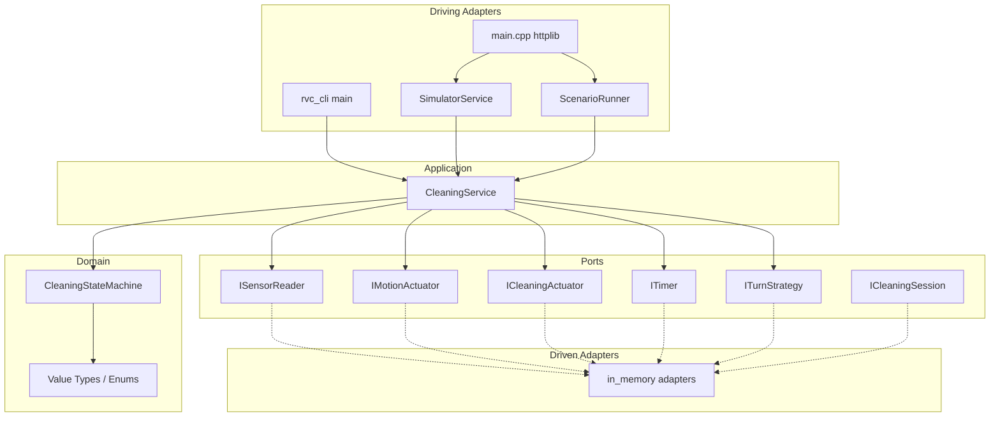
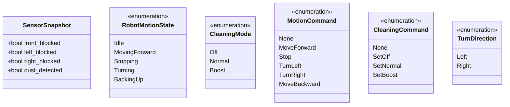
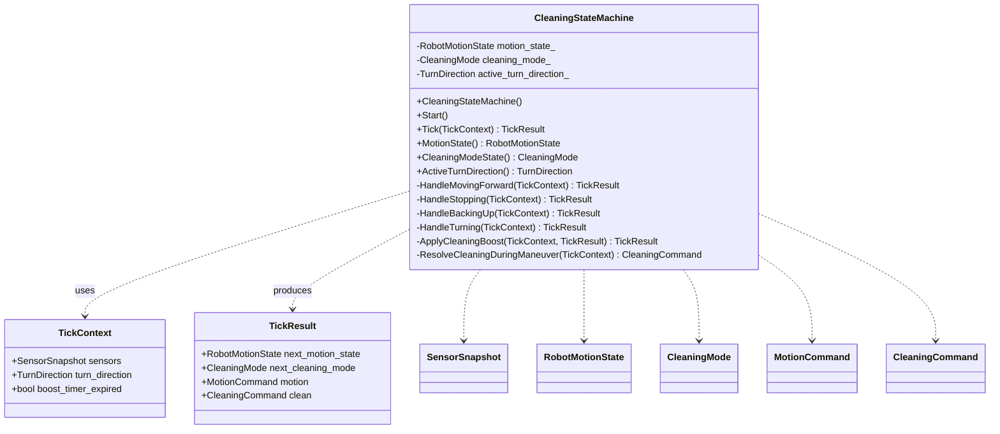
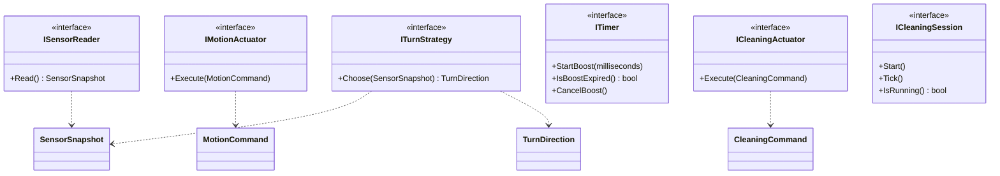
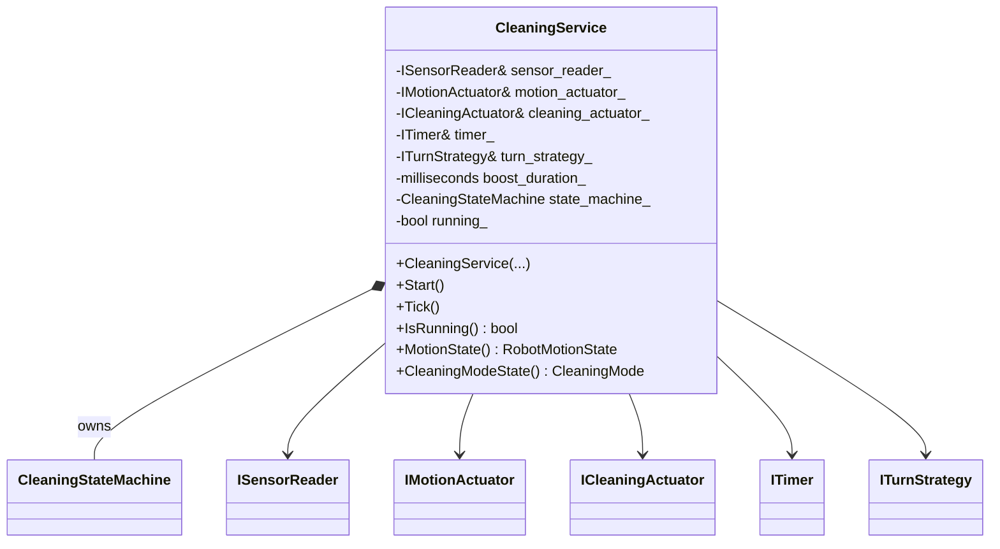
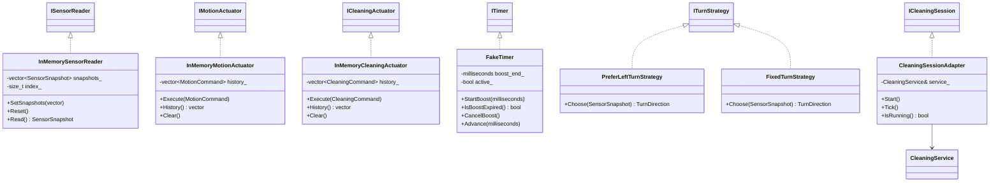
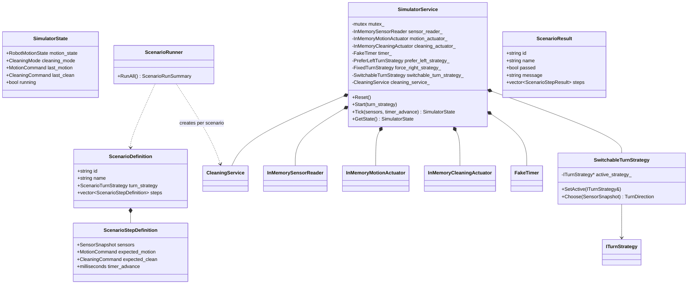
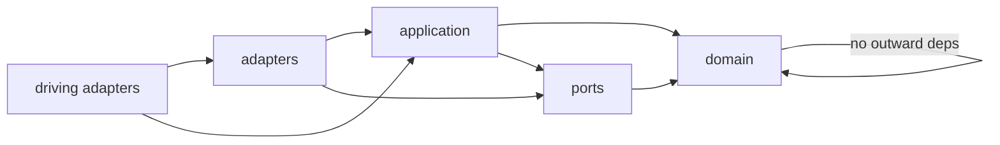

# Class Diagram — RVC Control SW

현재 구현 클래스·인터페이스 관계를 레이어별로 정리합니다.  
네임스페이스: `rvc::domain`, `rvc::ports`, `rvc::application`, `rvc::adapters`, `rvc::simulator`

---

## 레이어 개요

---

## Domain — 값 객체·열거형

---

## Domain — 상태 머신

**상태 전이 요약**

| 현재 상태 | 조건 | 다음 상태 | 대표 명령 |
|-----------|------|-----------|-----------|
| `Idle` | `Start()` | `MovingForward` | — |
| `MovingForward` | 전방 막힘 | `Stopping` | `Stop` |
| `MovingForward` | 삼방 막힘 | `BackingUp` | `MoveBackward` |
| `MovingForward` | 통로 확보 | `MovingForward` | `MoveForward` |
| `Stopping` | — | `Turning` | `TurnLeft`/`TurnRight` |
| `BackingUp` | — | `Turning` | `TurnLeft`/`TurnRight` |
| `Turning` | 전방 확보 | `MovingForward` | `MoveForward` |
| `Turning` | 전방 막힘 | `Turning` | `TurnLeft`/`TurnRight` |

---

## Ports — 인터페이스

---

## Application

`CleaningService`는 **유일한 애플리케이션 서비스**이며, 포트를 조합해 1틱 오케스트레이션을 담당합니다.

---

## Driven Adapters (`src/adapters/in_memory/`)

| 클래스 | 역할 |
|--------|------|
| `InMemorySensorReader` | Tick마다 주입된 센서 스냅샷 반환 |
| `InMemoryMotionActuator` | 동작 명령 기록 (HW 대체) |
| `InMemoryCleaningActuator` | 청소 명령 기록 (HW 대체) |
| `FakeTimer` | 부스트 타이머 시뮬레이션 (`Advance`로 테스트 가속) |
| `PreferLeftTurnStrategy` | 좌측 통로 우선 회전 |
| `FixedTurnStrategy` | 항상 우회전 |
| `CleaningSessionAdapter` | `ICleaningSession` 포트 → `CleaningService` 위임 |

---

## Simulator (`simulator/server/`)

---

## Driving Adapters

| 진입점 | 파일 | 의존 |
|--------|------|------|
| `rvc_cli` | `src/adapters/cli/main.cpp` | `rvc_adapters` |
| `rvc_simulator` | `simulator/server/main.cpp` | `SimulatorService`, `ScenarioRunner`, httplib |
| `rvc_tests` | `tests/domain/*`, `tests/application/*` | `rvc_application`, `rvc_adapters`, GTest |
| `rvc_scenario_tests` | `scenario_test_main.cpp` | 시나리오 러너 단독 실행 |

---

## 의존성 규칙 (헥사고날)

- **Domain**은 표준 라이브러리 외 의존 없음.
- **Ports**는 Domain 타입만 참조 (INTERFACE 라이브러리 `rvc_ports`).
- **Application**은 Ports·Domain만 참조.
- **Adapters**가 Ports를 구현; CLI·시뮬레이터·테스트가 Application을 호출.

---

## 관련 문서

- [UseCase_Diagram.md](UseCase_Diagram.md)
- [Sequence_Diagram.md](Sequence_Diagram.md)
- [Module_View.md](Module_View.md)
