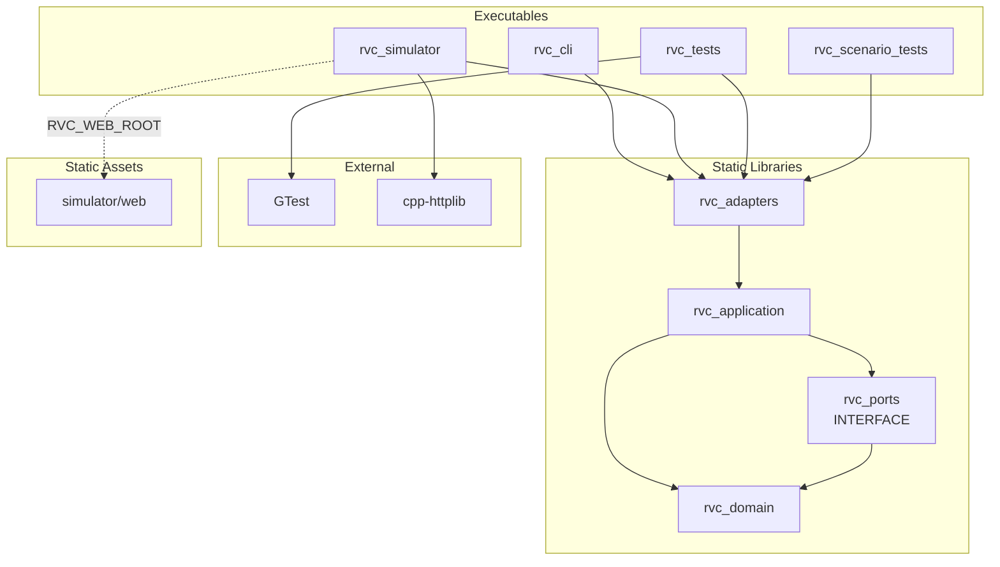
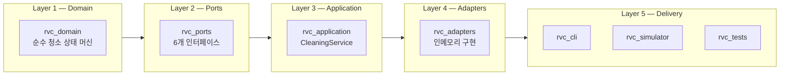
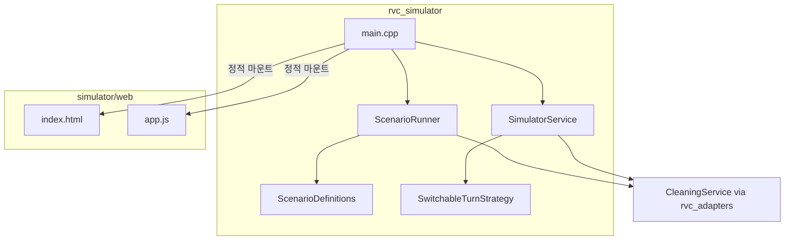
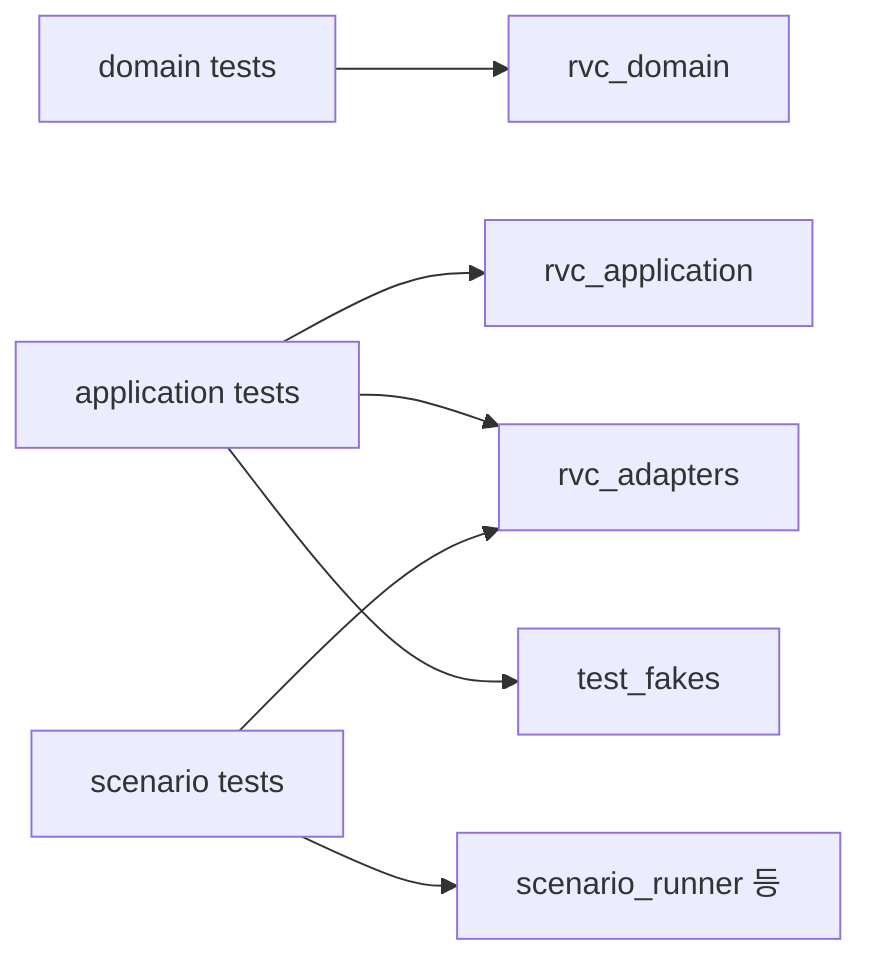
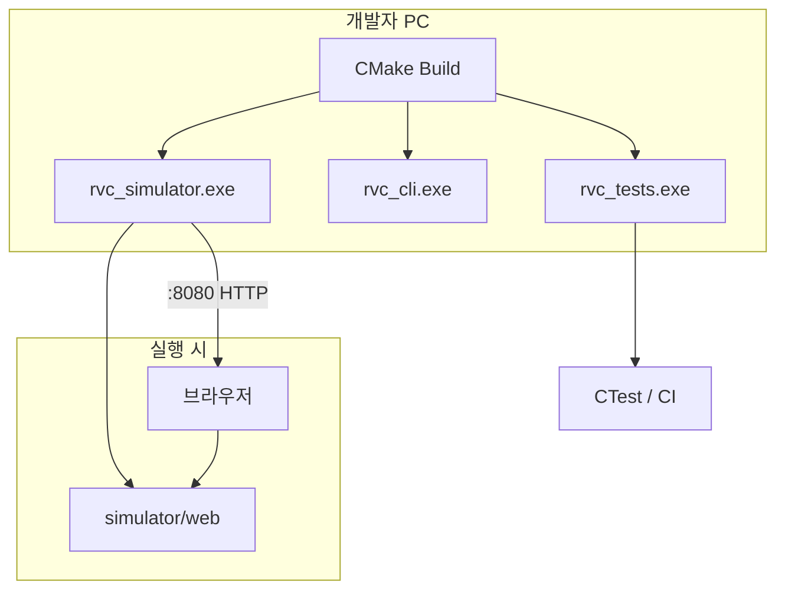

# Module View — RVC Control SW

CMake 타깃·디렉터리·의존 관계를 중심으로 한 **모듈 뷰(Module View)** 입니다.

---

## 1. 논리 모듈 맵



---

## 2. 물리 디렉터리 ↔ 모듈

```
c:\yul2ya\
├── CMakeLists.txt              # 루트 빌드 정의
├── src/
│   ├── domain/                 # rvc_domain
│   ├── application/            # rvc_application
│   ├── ports/                  # rvc_ports (헤더만)
│   └── adapters/
│       ├── in_memory/          # rvc_adapters
│       └── cli/                # rvc_cli (main만)
├── tests/                      # rvc_tests
├── simulator/
│   ├── server/                 # rvc_simulator, rvc_scenario_tests
│   └── web/                    # 정적 UI (빌드 타깃 없음)
├── cmake/
│   └── gtest.cmake
└── doc/                        # 설계 문서
```

---

## 3. CMake 타깃 상세

| 타깃 | 종류 | 소스 | 링크 |
|------|------|------|------|
| `rvc_domain` | STATIC | `cleaning_state_machine.cpp` | — |
| `rvc_ports` | INTERFACE | (헤더) | `rvc_domain` include 전파 |
| `rvc_application` | STATIC | `cleaning_service.cpp` | `rvc_domain`, `rvc_ports` |
| `rvc_adapters` | STATIC | `in_memory/*`, `cleaning_session_adapter.cpp` | `rvc_application` |
| `rvc_cli` | EXEC | `adapters/cli/main.cpp` | `rvc_adapters` |
| `rvc_simulator` | EXEC | `simulator/server/*.cpp` | `rvc_adapters`, `httplib` |
| `rvc_tests` | EXEC | `tests/domain/*`, `tests/application/*` | `rvc_application`, `rvc_adapters`, GTest |
| `rvc_scenario_tests` | EXEC | `scenario_test_main.cpp` + server 일부 | `rvc_adapters` |

**빌드 옵션**

| 옵션 | 기본값 | 설명 |
|------|--------|------|
| `RVC_BUILD_SIMULATOR` | ON | `rvc_simulator`, `rvc_scenario_tests` |
| `RVC_BUILD_TESTS` | ON | `rvc_tests`, CTest 등록 |

---

## 4. 레이어별 모듈 책임



| 레이어 | 모듈 | 책임 | 외부 의존 |
|--------|------|------|-----------|
| Domain | `rvc_domain` | 장애물·먼지·상태 전이 규칙 | 없음 |
| Ports | `rvc_ports` | HW/외부 시스템 경계 계약 | Domain 타입만 |
| Application | `rvc_application` | 1틱 오케스트레이션 | Ports, Domain |
| Adapters | `rvc_adapters` | 포트 인메모리 구현 | Application |
| Delivery | CLI·Simulator·Tests | 사용자·HTTP·검증 진입 | Adapters |

---

## 5. Domain 모듈 (`rvc_domain`)

**공개 API**

| 파일 | 내용 |
|------|------|
| `cleaning_state_machine.hpp/.cpp` | `CleaningStateMachine`, `TickContext`, `TickResult` |
| `sensor_snapshot.hpp` | `SensorSnapshot` |
| `robot_state.hpp` | `RobotMotionState` |
| `cleaning_mode.hpp` | `CleaningMode` |
| `motion_command.hpp` | `MotionCommand`, `CleaningCommand`, `TurnDirection` |

**제약**: Domain은 `ports`, `application`, `adapters`를 참조하지 않습니다.

---

## 6. Ports 모듈 (`rvc_ports`)

| 헤더 | 인터페이스 | 구현체 (adapters) |
|------|------------|-------------------|
| `sensor_reader.hpp` | `ISensorReader` | `InMemorySensorReader` |
| `motion_actuator.hpp` | `IMotionActuator` | `InMemoryMotionActuator` |
| `cleaning_actuator.hpp` | `ICleaningActuator` | `InMemoryCleaningActuator` |
| `timer.hpp` | `ITimer` | `FakeTimer` |
| `turn_strategy.hpp` | `ITurnStrategy` | `PreferLeftTurnStrategy`, `FixedTurnStrategy`, `SwitchableTurnStrategy` |
| `cleaning_session.hpp` | `ICleaningSession` | `CleaningSessionAdapter` |

---

## 7. Application 모듈 (`rvc_application`)

| 클래스 | 파일 | 역할 |
|--------|------|------|
| `CleaningService` | `cleaning_service.hpp/.cpp` | 센서 읽기 → 상태 머신 → 액추에이터·타이머 실행 |

유일한 애플리케이션 서비스이며, 향후 모바일 앱 연동·세션 관리 확장 시 이 레이어에 추가됩니다.

---

## 8. Adapters 모듈 (`rvc_adapters`)

### 8.1 Driven Adapters (인메모리)

```
src/adapters/in_memory/
├── in_memory_sensor_reader.*
├── in_memory_motion_actuator.*
├── in_memory_cleaning_actuator.*
├── fake_timer.*
├── prefer_left_turn_strategy.*
├── fixed_turn_strategy.*
└── cleaning_session_adapter.*
```

### 8.2 Driving Adapter (CLI)

```
src/adapters/cli/main.cpp   → rvc_cli
```

---

## 9. Simulator 모듈 (`simulator/`)

시뮬레이터는 **별도 정적 라이브러리 없이** `rvc_simulator` 실행 파일에 server 소스를 직접 포함합니다.

```
simulator/
├── web/                          # 프론트엔드 모듈 (정적)
│   ├── index.html
│   └── app.js
└── server/                       # HTTP Driving Adapter
    ├── main.cpp                  # REST 라우팅, JSON 파싱
    ├── simulator_service.*       # 수동 모드 세션
    ├── scenario_runner.*         # 자동 테스트 실행
    ├── scenario_definitions.*    # 5개 시나리오 정의
    └── switchable_turn_strategy.*# 런타임 회전 전략 전환
```



**컴파일 정의**: `RVC_WEB_ROOT="${CMAKE_SOURCE_DIR}/simulator/web"`

---

## 10. Test 모듈

| 모듈 | 경로 | 범위 |
|------|------|------|
| Domain tests | `tests/domain/cleaning_state_machine_test.cpp` | 상태 머신 9케이스 |
| Application tests | `tests/application/cleaning_service_test.cpp` | 서비스 5케이스 |
| Test fakes | `tests/application/test_fakes.*` | 포트 페이크 |
| Scenario tests | `simulator/server/scenario_test_main.cpp` | 시나리오 러너 통합 |



---

## 11. 런타임 배포 뷰



| 실행 파일 | 용도 | 산출물 경로 (Debug) |
|-----------|------|---------------------|
| `rvc_tests.exe` | 유닛 테스트 | `build/Debug/` |
| `rvc_cli.exe` | 터미널 시나리오 | `build/Debug/` |
| `rvc_simulator.exe` | 웹 시뮬레이터 | `build/simulator/server/Debug/` |
| `rvc_scenario_tests.exe` | 시나리오 단독 테스트 | `build/simulator/server/Debug/` |

---

## 12. 의존성 방향 (허용 / 금지)

| From → To | 허용 |
|-----------|:----:|
| Delivery → Adapters | ✓ |
| Delivery → Application | ✓ (시뮬레이터 server) |
| Adapters → Application | ✓ |
| Adapters → Ports | ✓ |
| Application → Domain, Ports | ✓ |
| Ports → Domain | ✓ |
| Domain → (상위 레이어) | ✗ |
| Domain → Adapters | ✗ |
| Application → Adapters | ✗ |

---

## 13. 확장 시 모듈 교체 가이드

| 변경 사항 | 영향 모듈 | 작업 |
|-----------|-----------|------|
| 실제 HW 센서 연동 | `rvc_adapters` | `HwSensorReader : ISensorReader` 추가 |
| 모바일 앱 API | Delivery | 새 Driving Adapter (HTTP/gRPC) |
| 새 센서 타입 | Domain, Ports | `SensorSnapshot` 확장 → 상태 머신 갱신 |
| ML 경로 계획 | Application, Ports | `ITurnStrategy` 새 구현체 |
| 한 spot 순환 청소 | Domain, Application | 상태·유스케이스 추가 (Future 요구사항) |

핵심 원칙: **Domain·Application은 수정 최소화**, **Ports 구현체(Adapters) 교체**로 HW·UI를 분리합니다.

---

## 14. 문서 인덱스

| 문서 | 내용 |
|------|------|
| [UseCase_Diagram.md](UseCase_Diagram.md) | 액터·유스케이스 |
| [Class_Diagram.md](Class_Diagram.md) | 클래스·인터페이스 |
| [Sequence_Diagram.md](Sequence_Diagram.md) | 실행 시퀀스 |
| [Module_View.md](Module_View.md) | 본 문서 — 모듈·빌드 |
| [Preliminary_Requirements.md](Preliminary_Requirements.md) | 요구사항 |
| [Simulator_Architecture.md](Simulator_Architecture.md) | 시뮬레이터 상세 |

---

## 15. 빌드·실행 빠른 참조

```powershell
cmake -S . -B build -G "Visual Studio 17 2022" -A x64
cmake --build build --config Debug

# 유닛 테스트
& "C:\Program Files\CMake\bin\ctest.exe" --test-dir build -C Debug

# 시뮬레이터
.\build\simulator\server\Debug\rvc_simulator.exe
# → http://localhost:8080
```
