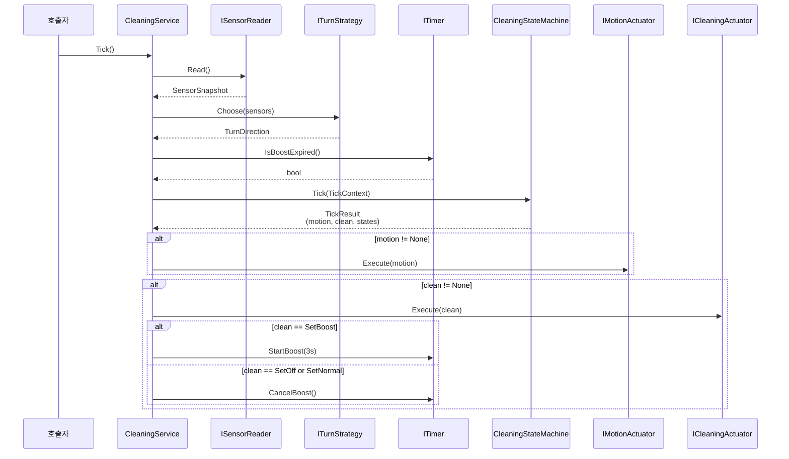
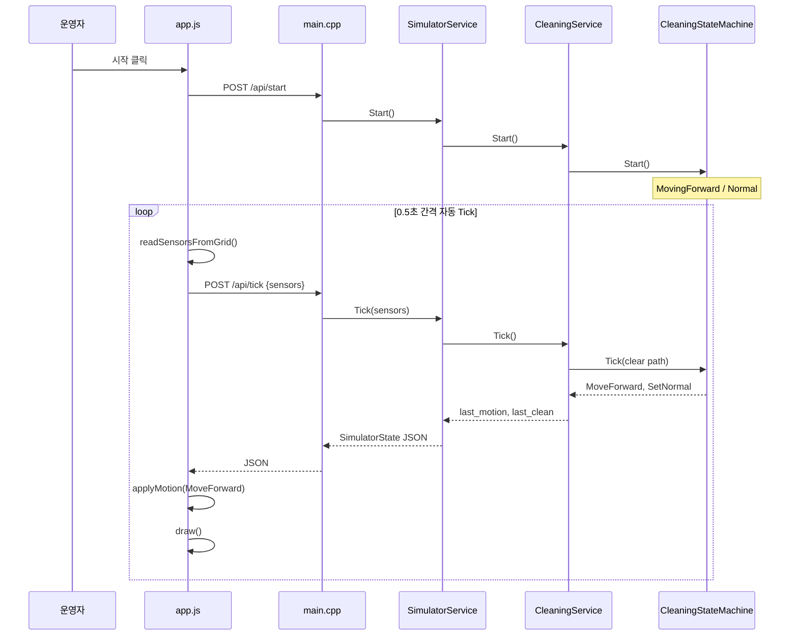
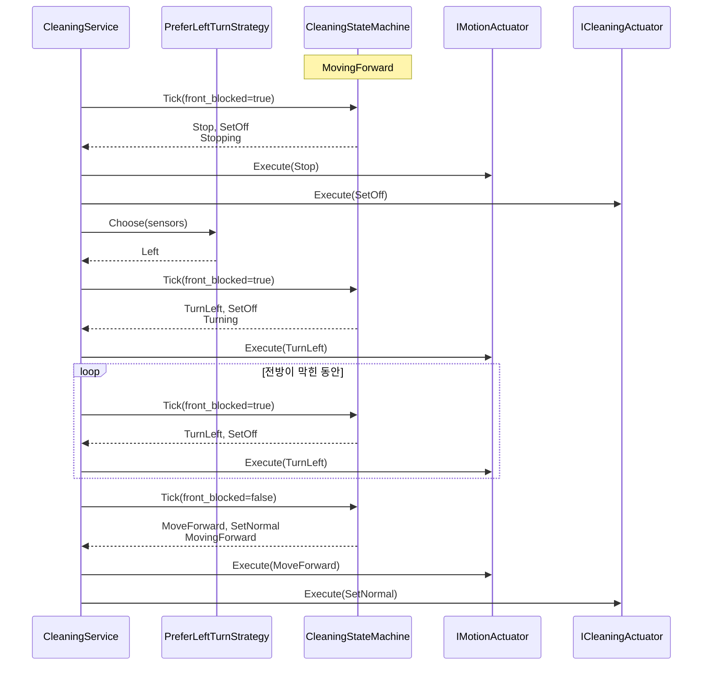
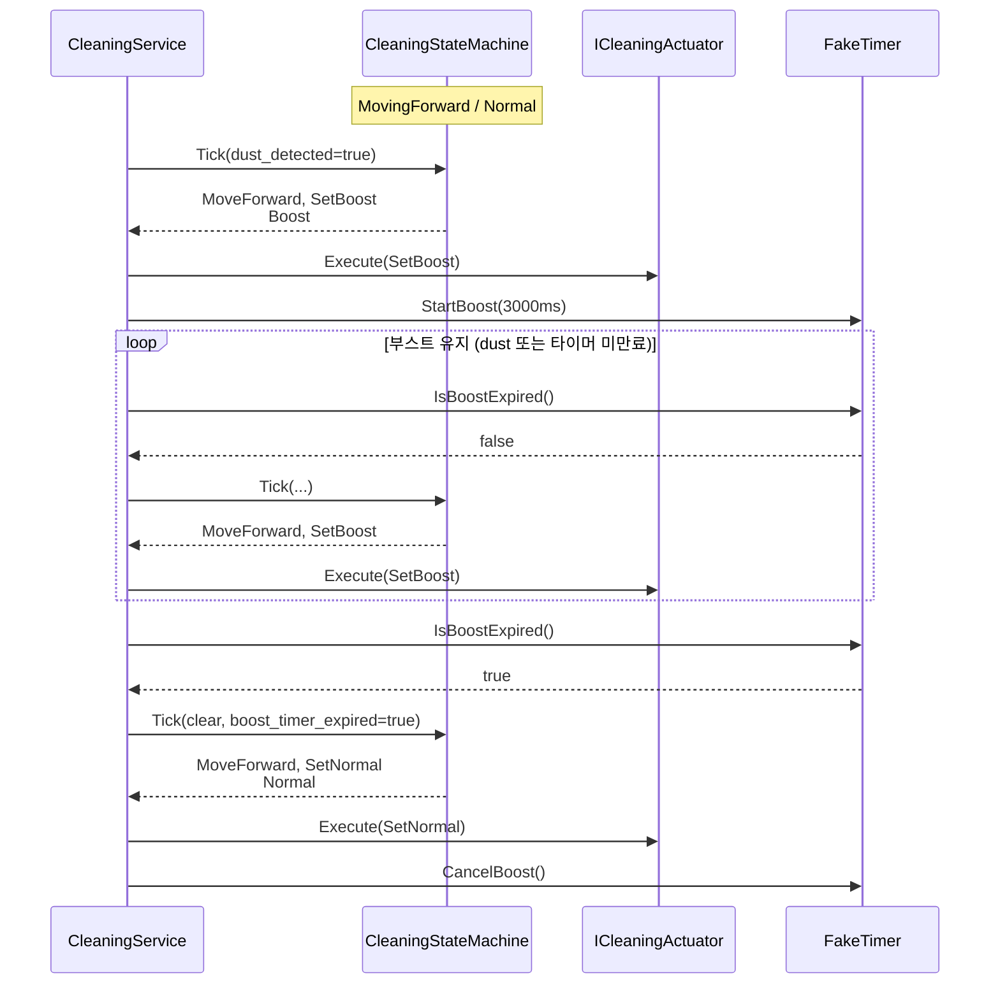
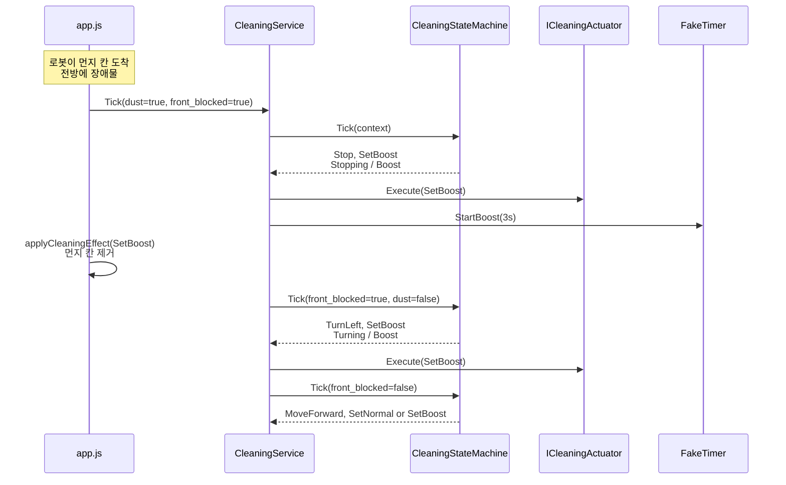
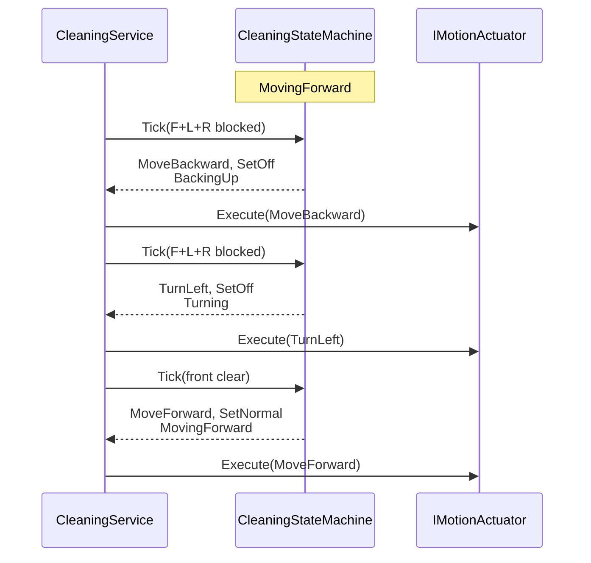
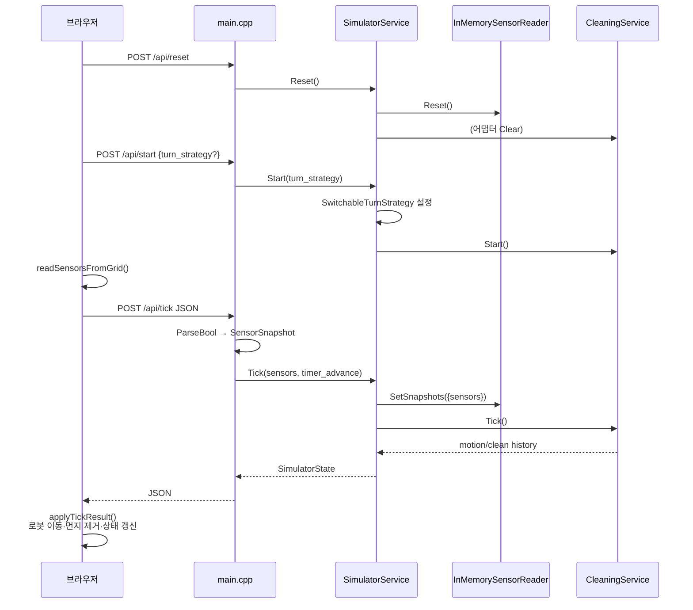
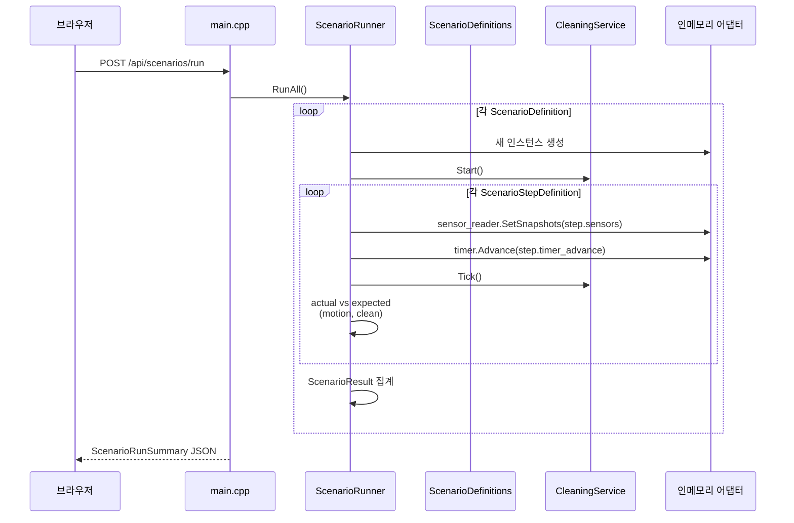
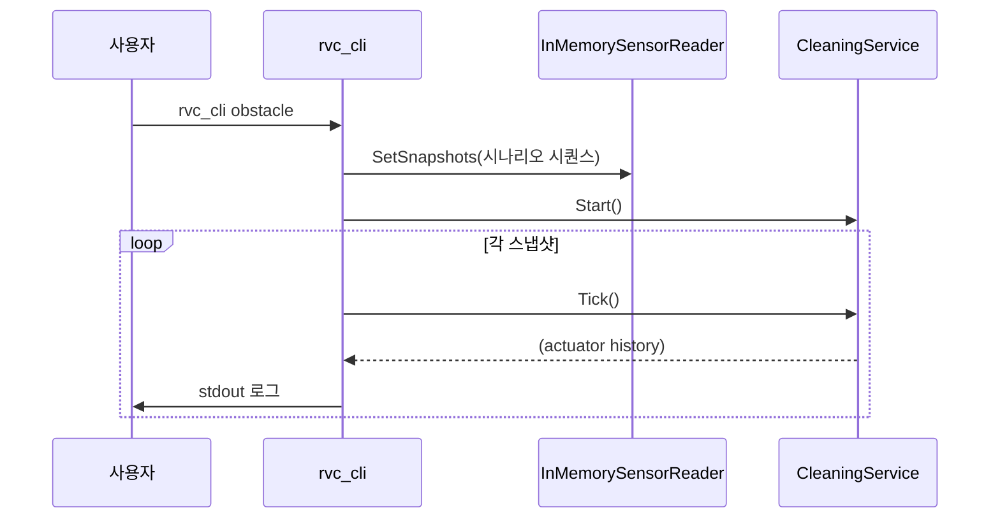
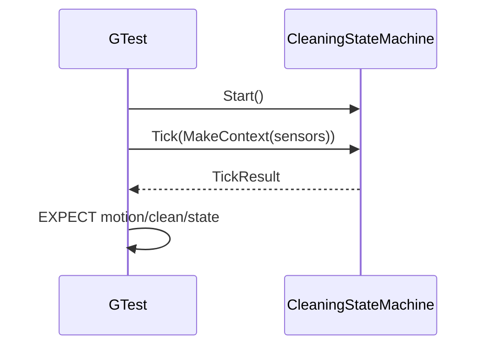

# Sequence Diagram — RVC Control SW

현재 구현의 대표 실행 흐름을 시퀀스 다이어그램으로 정리합니다.

---

## 1. CleaningService — 1틱 공통 흐름

모든 진입점(CLI, 시뮬레이터 수동/자동, 유닛 테스트)이 공유하는 핵심 시퀀스입니다.

**코드 위치**: `src/application/cleaning_service.cpp`

---

## 2. 무장애물 직진 청소

**조건**: `front_blocked == false`, `dust_detected == false`

---

## 3. 전방 장애물 회피 (정지 → 회전 → 재개)

**회전 방향**: `PreferLeftTurnStrategy` — 좌측 비막힘이면 `Left`, 아니면 `Right`

---

## 4. 먼지 감지 부스트 (타이머 만료 포함)

**부스트 기본 시간**: `std::chrono::seconds(3)` (`CleaningService` 생성자 기본값)

---

## 5. 장애물 앞 먼지 칸 — 회전 중 부스트 유지

먼지 칸에 도착한 틱에 전방 장애물도 감지될 때, 동작은 정지·회전하되 청소는 부스트로 유지합니다.

**구현**: `CleaningStateMachine::ResolveCleaningDuringManeuver()`  
**코드**: `src/domain/cleaning_state_machine.cpp`

---

## 6. 삼방 막힘 — 후진 → 회전 → 재개

---

## 7. 시뮬레이터 수동 모드 — Start ~ Tick

**주의**: 그리드 좌표·로봇 애니메이션은 `app.js`가 담당하며, C++ 서버는 JSON 센서만 신뢰합니다.

---

## 8. 시나리오 자동 테스트

`ScenarioRunner`는 시나리오마다 **새 어댑터·CleaningService**를 생성하며 `SimulatorService`와 상태를 공유하지 않습니다.

**5개 시나리오**: `forward_cleaning`, `front_obstacle`, `all_sides_blocked`, `dust_boost`, `right_turn_obstacle`

---

## 9. CLI 시나리오 실행

---

## 10. 유닛 테스트 — 도메인 격리

도메인 테스트는 **포트·어댑터 없이** `CleaningStateMachine`만 직접 검증합니다.  
애플리케이션 테스트는 `tests/application/test_fakes.hpp`의 페이크 포트로 `CleaningService`를 검증합니다.

---

## 시퀀스 ↔ 파일 매핑

| 시퀀스 | 주요 파일 |
|--------|-----------|
| 1틱 공통 | `cleaning_service.cpp`, `cleaning_state_machine.cpp` |
| 수동 시뮬레이터 | `main.cpp`, `simulator_service.cpp`, `app.js` |
| 자동 시나리오 | `scenario_runner.cpp`, `scenario_definitions.cpp` |
| CLI | `src/adapters/cli/main.cpp` |
| 유닛 테스트 | `tests/domain/*`, `tests/application/*` |

---

## 관련 문서

- [UseCase_Diagram.md](UseCase_Diagram.md)
- [Class_Diagram.md](Class_Diagram.md)
- [Module_View.md](Module_View.md)
- [Simulator_Architecture.md](Simulator_Architecture.md)
