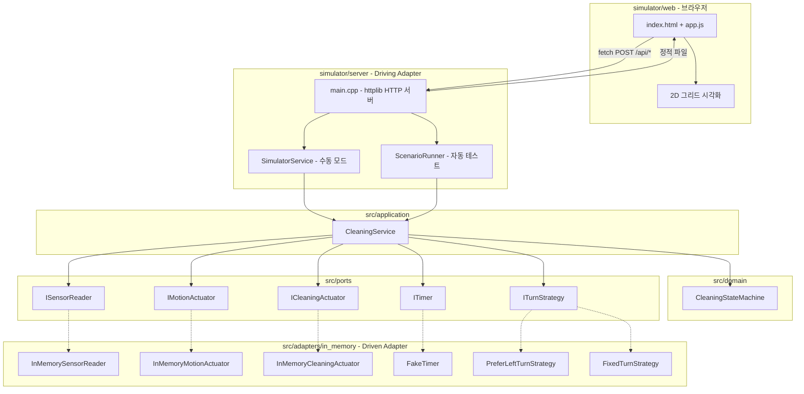
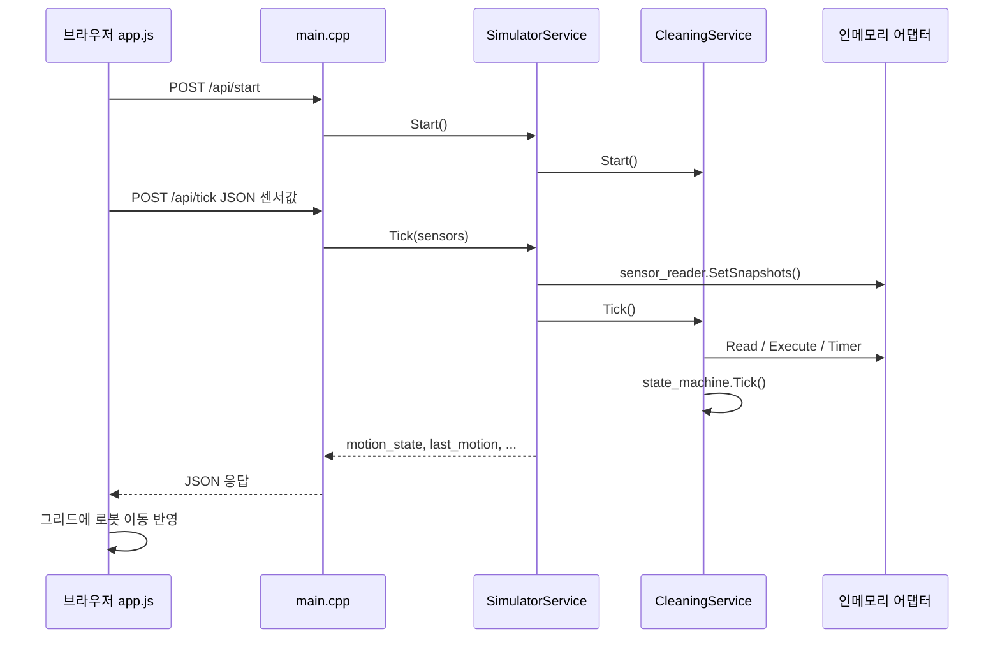
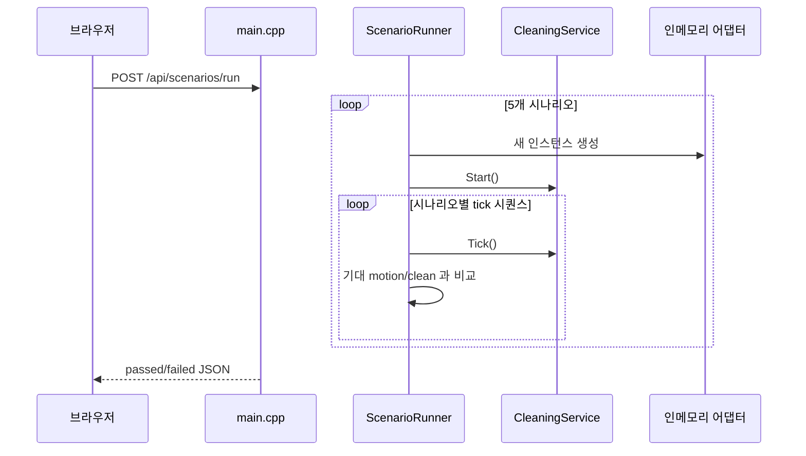
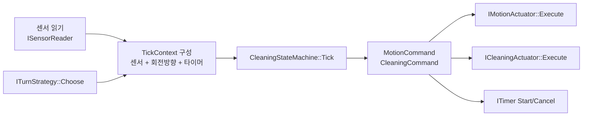

# 시뮬레이터와 C++ 구현 연결 구조

웹 시뮬레이터는 **헥사고날 아키텍처의 Driving Adapter(HTTP)** 로 동작합니다.  
브라우저·REST API 요청을 받아 `CleaningService`를 호출하고, 센서·액추에이터는 **인메모리 어댑터**로 대체합니다.

핵심 제어 로직(`domain`, `application`)은 시뮬레이터와 CLI가 **동일한 코드**를 공유합니다.

---

## 전체 구조



---

## 빌드·실행 연결

| 구성 요소 | 경로 | CMake 타깃 | 역할 |
|-----------|------|------------|------|
| 도메인 | `src/domain/` | `rvc_domain` | 상태 머신 (순수 로직) |
| 애플리케이션 | `src/application/` | `rvc_application` | `CleaningService` |
| 인메모리 어댑터 | `src/adapters/in_memory/` | `rvc_adapters` | 포트 구현체 |
| HTTP 서버 | `simulator/server/` | `rvc_simulator` | 웹 API + 시나리오 실행 |
| 웹 UI | `simulator/web/` | (정적 파일) | `RVC_WEB_ROOT`로 마운트 |
| CLI | `src/adapters/cli/` | `rvc_cli` | 동일 코어, 터미널 진입점 |

`rvc_simulator`는 `rvc_adapters` → `rvc_application` → `rvc_domain` 순으로 링크됩니다.

---

## 두 가지 동작 모드

### 1. 수동 모드 (Manual)

브라우저에서 Tick을 누를 때마다 서버의 **하나의 `SimulatorService` 인스턴스**가 1스텝 진행합니다.



- **센서 입력**: UI 체크박스 또는 캔버스 그리드에서 계산한 `SensorSnapshot` JSON
- **출력**: `last_motion`, `last_clean` 등 → 브라우저가 2D 애니메이션에 사용
- **주의**: 그리드 시각화는 **프론트엔드 전용**이며, C++ 판단 로직과는 별개입니다. C++는 JSON으로 받은 센서 값만 사용합니다.

### 2. 자동 테스트 모드 (Auto)

`ScenarioRunner`가 시나리오마다 **새로운 `CleaningService` + 어댑터 세트**를 만들어 검증합니다.  
`SimulatorService` 상태와 **독립**입니다.



---

## Tick 한 번의 내부 흐름 (공통)

`CleaningService::Tick()`이 도메인과 어댑터를 연결하는 중심입니다.



| 단계 | 코드 위치 | 설명 |
|------|-----------|------|
| 1 | `InMemorySensorReader` | 웹/시나리오가 넣은 `SensorSnapshot` 반환 |
| 2 | `PreferLeftTurnStrategy` 등 | 좌/우 회전 방향 결정 |
| 3 | `CleaningStateMachine` | 장애물·먼지에 따른 상태 전이 |
| 4 | `InMemoryMotionActuator` | `MoveForward`, `Stop`, `TurnLeft` … 기록 |
| 5 | `InMemoryCleaningActuator` | `SetNormal`, `SetBoost`, `SetOff` 기록 |
| 6 | `FakeTimer` | 부스트 3초 타이머 (자동 테스트에서 `Advance`) |

---

## HTTP API ↔ C++ 매핑

| API | C++ 처리 | 비고 |
|-----|----------|------|
| `POST /api/start` | `SimulatorService::Start()` | 수동 세션 시작 |
| `POST /api/tick` | `SimulatorService::Tick(sensors)` | JSON → `SensorSnapshot` |
| `POST /api/reset` | `SimulatorService::Reset()` | 수동 세션 초기화 |
| `GET /api/state` | `SimulatorService::GetState()` | 현재 상태 조회 |
| `POST /api/scenarios/run` | `ScenarioRunner::RunAll()` | 5개 시나리오 일괄 검증 |
| `GET /` | `simulator/web/` 정적 파일 | UI |

---

## 관련 파일 빠른 참조

```
simulator/
  web/
    index.html    # 수동/자동 탭 UI
    app.js        # fetch → API, 그리드 렌더링
  server/
    main.cpp              # HTTP 라우팅, JSON 변환
    simulator_service.*   # 수동 모드용 CleaningService 래퍼
    scenario_runner.*     # 자동 시나리오 정의·검증

src/
  domain/cleaning_state_machine.*   # 핵심 규칙 (시뮬레이터가 수정하지 않음)
  application/cleaning_service.*    # 포트 조합
  adapters/in_memory/*              # 시뮬레이터·테스트·CLI 공용 어댑터
```

---

## 설계 요약

- 시뮬레이터 서버는 **새로운 도메인 로직을 만들지 않고**, 기존 `CleaningService`를 HTTP로 노출합니다.
- HW 대신 `in_memory` 어댑터가 센서·모터·청소 모듈을 **메모리 상 기록**으로 대체합니다.
- 수동 모드는 **사람이 센서를 주입**하고, 자동 모드는 **시나리오가 센서 시퀀스를 주입**합니다.
- 실제 HW 연동 시에는 `in_memory` 대신 `HwSensorAdapter` 등 **동일 포트의 다른 어댑터**만 교체하면 됩니다.
