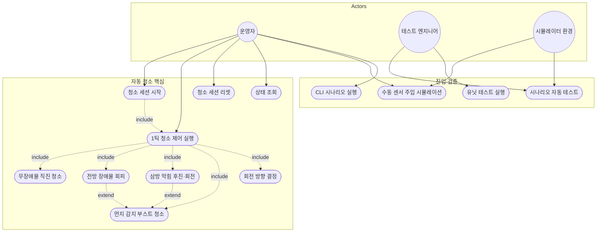

# Use Case Diagram — RVC Control SW

현재 구현(`src/`, `simulator/`, `tests/`)을 기준으로 한 유스케이스 다이어그램입니다.  
요구사항 출처: [Preliminary_Requirements.md](Preliminary_Requirements.md)

---

## 액터 (Actors)

| 액터 | 설명 | 진입점 |
|------|------|--------|
| **운영자** | 청소기를 시작·관찰·중단하는 사용자 | 웹 UI, CLI |
| **테스트 엔지니어** | 시나리오 자동 검증을 실행하는 사용자 | 웹 자동 테스트 탭, `rvc_tests`, `rvc_scenario_tests` |
| **시뮬레이터** | 센서 값을 HTTP/메모리로 주입하는 환경 | `SimulatorService`, `ScenarioRunner`, 테스트 페이크 |

> HW 제어(모터·브러시 드라이버)는 요구사항 범위 밖이며, 현재는 **인메모리 어댑터**가 대체합니다.

---

## 유스케이스 다이어그램

---

## 유스케이스 명세

### UC1 — 청소 세션 시작

| 항목 | 내용 |
|------|------|
| **액터** | 운영자 |
| **설명** | 자동 청소 루프를 시작한다. 동작 상태는 `MovingForward`, 청소 모드는 `Normal`로 전환된다. |
| **구현** | `CleaningService::Start()`, `CleaningStateMachine::Start()` |
| **진입점** | `POST /api/start`, CLI `Start` 후 첫 Tick, 시나리오 `Run` |

**사전 조건**: 세션이 Idle이거나 Reset 직후  
**사후 조건**: `running_ == true`, 부스트 타이머 취소

---

### UC2 — 1틱 청소 제어 실행

| 항목 | 내용 |
|------|------|
| **액터** | 운영자, 시뮬레이터 환경 |
| **설명** | 센서를 읽고 상태 머신을 1스텝 진행한 뒤 동작·청소 명령을 액추에이터에 전달한다. |
| **구현** | `CleaningService::Tick()` |
| **진입점** | `POST /api/tick`, CLI Tick, 시나리오 스텝 루프 |

**기본 흐름**:
1. `ISensorReader::Read()`로 `SensorSnapshot` 획득
2. `ITurnStrategy::Choose()`로 회전 방향 결정
3. `ITimer::IsBoostExpired()`로 부스트 만료 확인
4. `CleaningStateMachine::Tick()` → `MotionCommand`, `CleaningCommand`
5. `IMotionActuator`, `ICleaningActuator` 실행
6. 부스트 시작/취소 타이머 갱신

---

### UC3 — 무장애물 직진 청소

| 항목 | 내용 |
|------|------|
| **요구사항** | 장애물 없이 전진하며 청소 |
| **조건** | `front/left/right_blocked == false`, `dust_detected == false` |
| **결과** | `MoveForward` + `SetNormal` |
| **상태** | `MovingForward` / `Normal` |

---

### UC4 — 전방 장애물 회피

| 항목 | 내용 |
|------|------|
| **요구사항** | 전방 장애물 감지 시 청소 중단 → 좌/우 회전 → 전진 재개 |
| **조건** | `front_blocked == true`, 삼방 막힘 아님 |
| **전이** | `MovingForward` → `Stopping` → `Turning` → `MovingForward` |
| **청소** | 장애물만 있을 때 `SetOff`; **먼지 동시 감지 시** `SetBoost` (회전 중에도 흡입 유지) |
| **회전** | `PreferLeftTurnStrategy`(좌 우선) 또는 `FixedTurnStrategy`(우 고정) |

---

### UC5 — 삼방 막힘 후진·회전

| 항목 | 내용 |
|------|------|
| **요구사항** | 전·좌·우 모두 막히면 후진 후 회전 |
| **조건** | `front_blocked && left_blocked && right_blocked` |
| **전이** | `MovingForward` → `BackingUp` → `Turning` → `MovingForward` |
| **동작** | `MoveBackward` → `TurnLeft`/`TurnRight` → `MoveForward` |

---

### UC6 — 먼지 감지 부스트 청소

| 항목 | 내용 |
|------|------|
| **요구사항** | 먼지 감지 시 일정 시간 청소 파워 상승 |
| **조건** | `dust_detected == true` (전진·정지·회전 중 모두 적용 가능) |
| **결과** | `SetBoost`, `CleaningMode::Boost` |
| **타이머** | 기본 3초 (`boost_duration`), 만료 시 `SetNormal` |
| **UI** | 웹 그리드에서 `SetBoost` 시 해당 칸 먼지 제거 |

---

### UC7 — 회전 방향 결정

| 항목 | 내용 |
|------|------|
| **액터** | (UC2에 포함) |
| **전략** | `prefer_left`: 좌측 비막힘이면 좌회전, 아니면 우회전 |
| | `force_right`: 항상 우회전 |
| **구현** | `ITurnStrategy`, 시뮬레이터 `SwitchableTurnStrategy` |

---

### UC8 — 청소 세션 리셋

| 항목 | 내용 |
|------|------|
| **액터** | 운영자 |
| **설명** | 상태 머신·액추에이터 기록·타이머를 초기화한다. |
| **구현** | `SimulatorService::Reset()` |
| **진입점** | `POST /api/reset`, 웹 리셋 버튼 |

---

### UC9 — 상태 조회

| 항목 | 내용 |
|------|------|
| **액터** | 운영자 |
| **반환** | `motion_state`, `cleaning_mode`, `last_motion`, `last_clean`, `running` |
| **진입점** | `GET /api/state`, Tick 응답 JSON |

---

### UC10 — 수동 센서 주입 시뮬레이션

| 항목 | 내용 |
|------|------|
| **액터** | 운영자, 시뮬레이터 환경 |
| **설명** | 웹 그리드·체크박스에서 계산한 센서를 Tick 요청 body로 전달한다. |
| **구현** | `app.js` → `POST /api/tick` → `InMemorySensorReader::SetSnapshots` |
| **비고** | 2D 그리드·로봇 위치 애니메이션은 **프론트엔드 전용**; C++는 JSON 센서만 사용 |

---

### UC11 — 시나리오 자동 테스트

| 항목 | 내용 |
|------|------|
| **액터** | 테스트 엔지니어 |
| **설명** | 5개 정의 시나리오를 독립 `CleaningService` 인스턴스로 실행·검증한다. |
| **시나리오** | `forward_cleaning`, `front_obstacle`, `all_sides_blocked`, `dust_boost`, `right_turn_obstacle` |
| **구현** | `ScenarioRunner`, `ScenarioDefinitions` |
| **진입점** | `POST /api/scenarios/run`, `GET /api/scenarios`, 웹 자동 테스트 탭 |

---

### UC12 — CLI 시나리오 실행

| 항목 | 내용 |
|------|------|
| **액터** | 운영자 |
| **설명** | 터미널에서 미리 정의된 센서 시퀀스로 Tick을 반복한다. |
| **구현** | `rvc_cli` (`forward`, `obstacle`, `deadend`, `dust`, `custom`) |

---

### UC13 — 유닛 테스트 실행

| 항목 | 내용 |
|------|------|
| **액터** | 테스트 엔지니어 |
| **범위** | 도메인 상태 머신(9케이스), `CleaningService` 통합(5케이스) |
| **구현** | `rvc_tests` (Google Test) |

---

## 액터별 유스케이스 매트릭스

| 유스케이스 | 운영자 | 테스트 엔지니어 | 시뮬레이터 |
|------------|:------:|:---------------:|:----------:|
| UC1 세션 시작 | ● | ● | |
| UC2 1틱 실행 | ● | ● | ● |
| UC3 직진 청소 | (포함) | (포함) | |
| UC4 장애물 회피 | (포함) | (포함) | |
| UC5 후진·회전 | (포함) | (포함) | |
| UC6 먼지 부스트 | (포함) | (포함) | |
| UC7 회전 방향 | (포함) | (포함) | |
| UC8 리셋 | ● | ● | |
| UC9 상태 조회 | ● | | |
| UC10 수동 센서 주입 | ● | | ● |
| UC11 시나리오 테스트 | | ● | ● |
| UC12 CLI | ● | | |
| UC13 유닛 테스트 | | ● | |

---

## 관련 문서

- [Class_Diagram.md](Class_Diagram.md) — 클래스 구조
- [Sequence_Diagram.md](Sequence_Diagram.md) — 시퀀스 흐름
- [Module_View.md](Module_View.md) — 모듈·빌드 뷰
- [Simulator_Architecture.md](Simulator_Architecture.md) — 시뮬레이터 연결 상세
